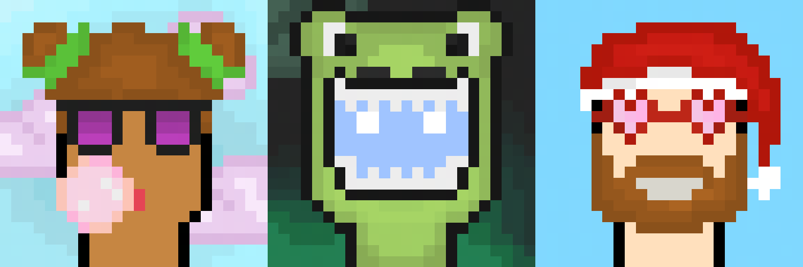

<h1 align="center">Buddies</h1>

  

<h4 align="center">
  <b>Our initiative was not for commercial purposes and does not encourage investment in NFTs <a href="https://www.howtogeek.com/774410/heres-the-problem-with-nfts/">(in fact, it is rather an advice not to do so)</a>, at least not in the current state of the market</b>. 
</h4>

  This project was aimed to learn how to <b>build products on the blockchain</b> and to deploy them in order to learn more about <b>web3</b>. 

  NFT being relatively easy to set up, we chose it and <b>we did the whole project ourselves</b>, from the development of the contract to the creation of the assets in pixelart. 

  We developed this project using <a href="https://soliditylang.org/">Solidity</a> for the <a href="https://en.wikipedia.org/wiki/Smart_contract">Smart Contract</a> and <a href="https://fr.wikipedia.org/wiki/C%2B%2B">C++</a> for the generator. 

  This project was done by <a href="https://github.com/bricerigagneau">Brice Rigagneau</a> and myself <a href="https://www.linkedin.com/in/livio-dal-maso-43a318198/">Livio Dal Maso</a>.

<h2 align="center">Buddies Generator</h2>

  A 24x24 pfp generator, made in C++ with the help of <a href="https://github.com/nothings/stb">stb</a> as part of the Buddies project. 
  This generator was specifically made by <a href="https://github.com/bricerigagneau">Brice Rigagneau</a> and myself <a href="https://www.linkedin.com/in/livio-dal-maso-43a318198/">Livio Dal Maso</a>.

  

